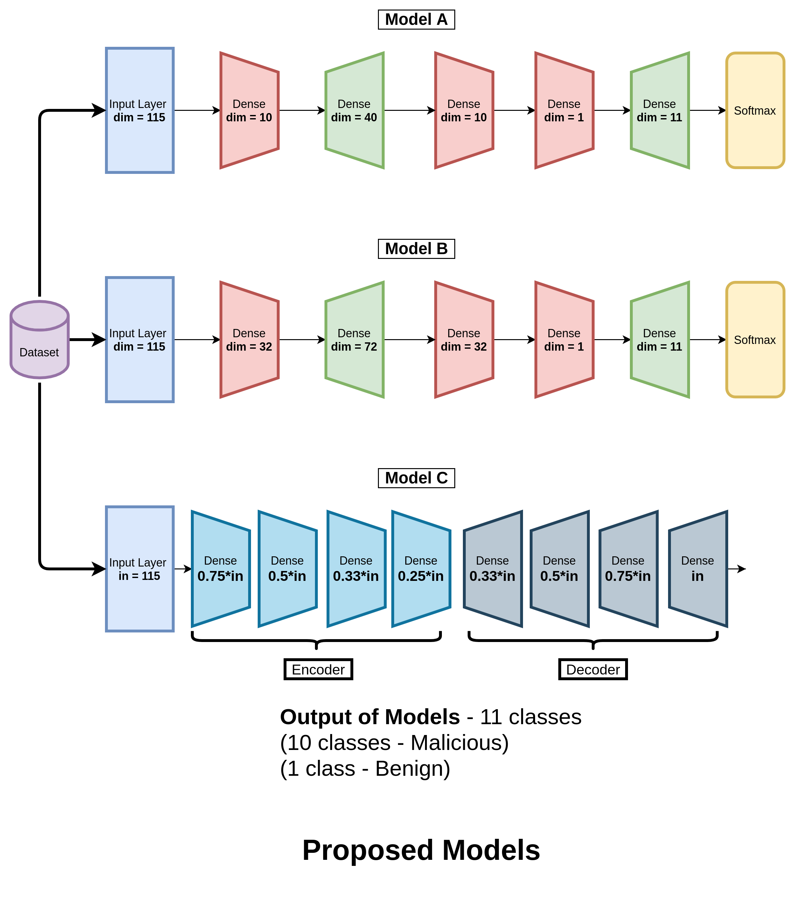

<div align="center">

# :radioactive:  The MiraiShield Project :radioactive: 


| **[ [```Initial Dataset```](<http://archive.ics.uci.edu/ml/datasets/detection_of_IoT_botnet_attacks_N_BaIoT>) ]** | **[ [```Project Proposal```](<documentation/IoT Mini Project - Proposal.pdf>) ]** | **[ [```Task```](<docs/assets/IoTPipeline.png>) ]** 
|:-------------------:|:-------------------:|:-------------------:|

# Model Diagram



</div>

# Project Structure - Detecting IoT Botnet Attacks
```                   
├── README.md                   
├── EDA                          # EDA, NAS and Self-Organising Maps
│    ├── bilinear.py
│    ├── features.py
│    ├── nas.py
│    └── som.py
├── Model_A                      # Base model #1
│    └── model.py
├── Model B                      # Base model #2
│    └── model.py
├── colab                        # Playground for notebooks
│    ├── IOT_IntrusionDetection_EDA_BaseModels.ipynb
│    └── Main_Model_DeepAE.ipynb
├── docs                         # Deploy docs
│    ├── _config.yml
│    ├── about.md
│    └── index.md
├── documentation                # Documentation of Project
│    ├── IoT Mini Project - Proposal.pdf
│    ├── IoT_Botnet_models.png
│    ├── IoT_Modelkey.png
│    ├── model2.png
│    └── nn.svg
└── Model_C                      # Proposed model - Baseline
     ├── test.py
     └── train.py
```     

# EDA Demo and Base Model Interactive Notebook 
<div align="center">
<a href="https://colab.research.google.com/drive/1Ierv-R_v7x1V-qxIzqcekYGGN1EZzqaA?usp=sharing">
  
</a>
</div>    

# References

```BibTeX
@misc{Dua:2019 ,
author = "Dua, Dheeru and Graff, Casey",
year = "2017",
title = "{UCI} Machine Learning Repository",
url = "http://archive.ics.uci.edu/ml",
institution = "University of California, Irvine, School of Information and Computer Sciences" }
```


```BibTeX
@ARTICLE{8490192,  
author={Meidan, Yair and Bohadana, Michael and Mathov, Yael and Mirsky, Yisroel and Shabtai, Asaf and Breitenbacher, Dominik and Elovici, Yuval},  
journal={IEEE Pervasive Computing},   
title={N-BaIoT—Network-Based Detection of IoT Botnet Attacks Using Deep Autoencoders},   
year={2018},  
volume={17},  
number={3},  
pages={12-22},  
doi={10.1109/MPRV.2018.03367731}}
```

