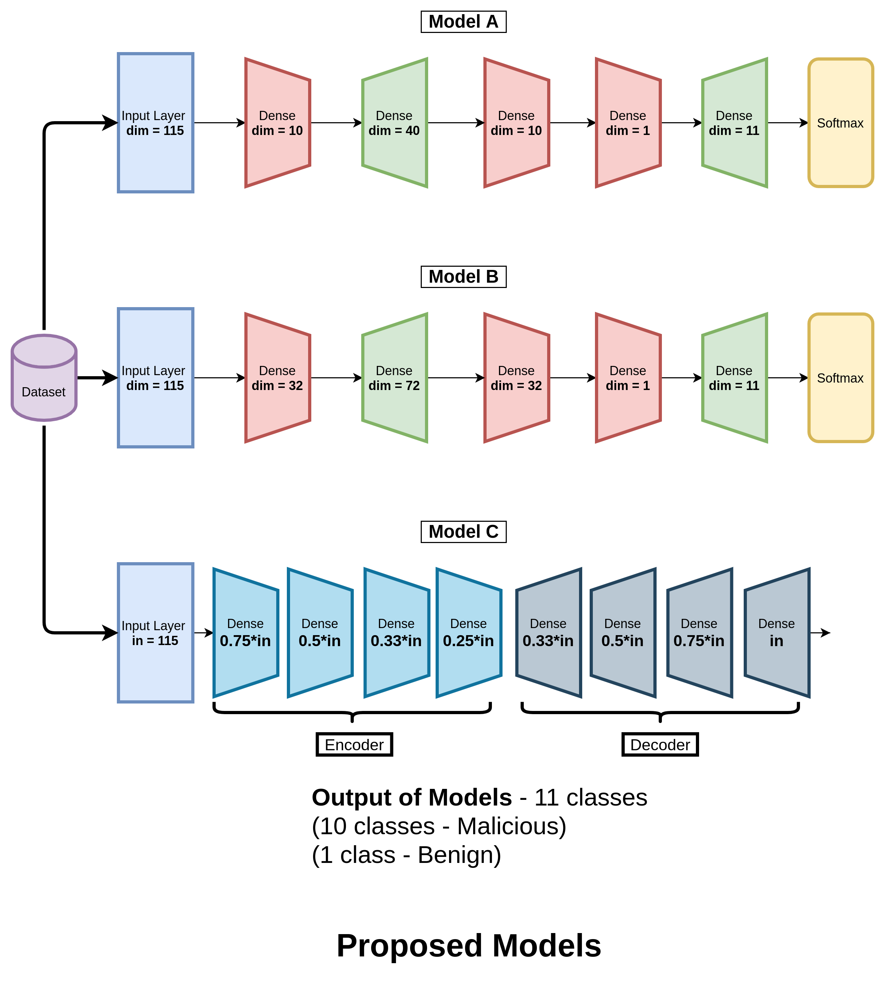
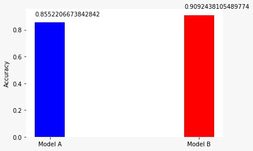

## Inspiration

There are billions of connected devices in 2021, and the applications with devices connected to the Internet are booming exponentially. This number is estimated to grow five fold in the next couple of years. If anything can stop IoT from taking over humanity, it is the security issues that arise with its public usage. Various malwares like the Mirai malware can take down a network and the current methods are not very effective agains it. **We have shown how a Deep learning model can tackle these threats**.


## What is Mirai?

Mirai is a vicious malware that turns any IoT network into a network controlled by bots. This network of bots is called **Botnet** and this Botnet is used to disrupt the traffic of the network by overwhelming the network with a flood of requests. This is called **distributed denial-of-service (DDoS) attack**. If the default username and password is not changed, Mirai can log into the network and attack it.

## Deep Learning

Deep learning is a subdomain of Machine Learning (ML) that uses Neural networks. If we analyse the network traffic, we'll be able to find which is Mirai attack and which is not. Lets say a network receives x requests per second normally. If it suddenly receives 2000x requests per second continuously, we can conclude its due to Mirai. So, if we're given the data about the network traffic, we can use that data to train a deep learning model to tell if it's infected by Mirai or not. 

In order to pre-train our model, we found an open-sourced dataset. [Link to the dataset](http://archive.ics.uci.edu/ml/datasets/detection_of_IoT_botnet_attacks_N_BaIoT). We used this dataset to pre-train our model. The Keras-like code has been demonstrated in this documentation, which can further be utilised .


## Training the Model

### First attempt - Model A

We created a neural network with input layer of dimension 115 and then subsequent dense layers of dimensions 10,40,10,1,11 followed by a Softmax activation function. 
The code:

```python
#imports
from sklearn.model_selection import train_test_split
from sklearn import metrics
from tensorflow.keras.models import Sequential
from tensorflow.keras.layers import Dense, Activation
from tensorflow.keras.callbacks import EarlyStopping
from sklearn.metrics import classification_report


def main():

    # Train test split
    x_train_st, x_test_st, y_train_st, y_test_st = train_test_split(
        train_data_st, labels, test_size=0.25, random_state=42)

    # Create and fit model
    model = Sequential()
    model.add(Dense(10, input_dim=train_data_st.shape[1], activation='relu'))
    model.add(Dense(40, input_dim=train_data_st.shape[1], activation='relu'))
    model.add(Dense(10, input_dim=train_data_st.shape[1], activation='relu'))
    model.add(Dense(1, kernel_initializer='normal'))
    model.add(Dense(labels.shape[1],activation='softmax'))
    model.compile(loss='categorical_crossentropy', optimizer='adam')
    monitor = EarlyStopping(monitor='val_loss', min_delta=1e-3, 
                            patience=5, verbose=1, mode='auto')
    model.fit(x_train_st,y_train_st,validation_data=(x_test_st,y_test_st),
            callbacks=[monitor],verbose=2,epochs=500)

    # Running eval          
    pred_st = model.predict(x_test_st)
    pred_st = np.argmax(pred_st,axis=1)
    y_eval_st = np.argmax(y_test_st,axis=1)
    score_st = metrics.accuracy_score(y_eval_st, pred_st)
    print("accuracy: {}".format(score_st))

    # Classification Report
    print(classification_report(y_eval_st, pred_st.argmax(-1)))

    
if __name__ == "__main__":
    main()   
```

<div align = "center">
The accuracy of this model was 0.855.
</div>    
    

### Second Attempt - Model B

This time we created a neural network with input layer of dimension 115 and then subsequent dense layers of dimensions 32,72,32,1,11 followed by a Softmax activation function. 
The code:
```python
#imports
from sklearn.model_selection import train_test_split
from sklearn import metrics
from tensorflow.keras.models import Sequential
from tensorflow.keras.layers import Dense, Activation
from tensorflow.keras.callbacks import EarlyStopping
from sklearn.metrics import classification_report


def main():

    # Train test split
    x_train_st, x_test_st, y_train_st, y_test_st = train_test_split(
        train_data_st, labels, test_size=0.25, random_state=42)

    # Create and fit model
    model2 = Sequential()
    model2.add(Dense(32, input_dim=train_data_st.shape[1], activation='relu'))
    model2.add(Dense(72, input_dim=train_data_st.shape[1], activation='relu'))
    model2.add(Dense(32, input_dim=train_data_st.shape[1], activation='relu'))
    model2.add(Dense(1, kernel_initializer='normal'))
    model2.add(Dense(labels.shape[1],activation='softmax'))
    model2.compile(loss='categorical_crossentropy', optimizer='adam')
    monitor = EarlyStopping(monitor='val_loss', min_delta=1e-3, 
                            patience=5, verbose=1, mode='auto')
    model2.fit(x_train_st,y_train_st,validation_data=(x_test_st,y_test_st),
            callbacks=[monitor],verbose=2,epochs=100)

    # Running eval          
    pred_st = model2.predict(x_test_st)
    pred_st_2 = np.argmax(pred_st,axis=1)
    y_eval_st_2 = np.argmax(y_test_st,axis=1)
    score_st_2 = metrics.accuracy_score(y_eval_st_2, pred_st_2)
    print("accuracy: {}".format(score_st_2))

    #Model 2 (Example)
    print(classification_report(y_eval_st_2, pred_st_2))

    
if __name__ == "__main__":
    main()   

```

<div align = "center">
The accuracy of this model is 0.909
</div>


**Models A and B are just an intelligent combination of multiple stages composed of upsampling and downsampling the feature space in order to simulate an expand-reduce transformation. This heuristic of designing our model does not perform as well as we require it to, as some information involving correlation between different features in the hidden dimensions is lost. Additionally, in the end, we apply a Softmax layer to obtain the probability distribution amongst all the 11 classes for easy classification into benign and the multiple sub-classes of malicious.**


### Third Attempt - Model C

An autoencoder is a neural network trained to reconstruct its inputs after they have been compressed. It consists of an encoder and a decoder part, which each consists of Linear layers in our case. The compression ensures that the network learns meaningful concepts, mainly the relationships between its input features. If we train the autoencoder solely on benign instances, it will successfully reconstruct normal observations but fail to reconstruct abnormal observations. 

When a significant reconstruction error has been calculated, the given observations are classified as an anomaly. We optimize the parameters and hyperparameters of each trained model so that when applied to unseen traffic, the model maximizes the true positive rate and minimizes the false positive rate (wrongly marking benign data as malicious).

The Keras Deep Learning framework was used for modeling and evaluation in Python. 
The code:
```python
# Initial Python package imports
import sys
import os
import pandas as pd
from glob import iglob
import numpy as np
from keras.models import load_model
import tensorflow as tf
from sklearn.preprocessing import StandardScaler

# Keras imports
from keras.models import Model, Sequential
from keras.layers import Input, Dense
from keras.callbacks import ModelCheckpoint, TensorBoard
from keras.optimizers import SGD

def train(top_n_features=10):

    scaler = StandardScaler()
    scaler.fit(x_train.append(x_opt))
    x_train = scaler.transform(x_train)
    x_opt = scaler.transform(x_opt)
    x_test = scaler.transform(x_test)

    model = autoenc_model(top_n_features)
    model.compile(loss="mean_squared_error",
                    optimizer="sgd")
    cp = ModelCheckpoint(filepath=f"models/model_{top_n_features}.h5",
                               save_best_only=True,
                               verbose=0)
    tb = TensorBoard(log_dir=f"./logs",
                histogram_freq=0,
                write_graph=True,
                write_images=True)

    # Train the model
    model.fit(x_train, x_train,
                    epochs=500,
                    batch_size=64,
                    validation_data=(x_opt, x_opt),
                    verbose=1,
                    callbacks=[cp, tb])

    x_opt_predictions = model.predict(x_opt)
    mse = np.mean(np.power(x_opt - x_opt_predictions, 2), axis=1)
    print("Mean is %.5f" % mse.mean())
    print("Min is %.5f" % mse.min())
    print("Max is %.5f" % mse.max())
    print("Std is %.5f" % mse.std())
    
    
    error_dev = mse.mean() + mse.std()

    with open(f'threshold_{top_n_features}', 'w') as t:
        t.write(str(error_dev))
    print(f"Threshold is {error_dev}")

    x_test_predictions = model.predict(x_test)
    print("MSE on the test set")
    mse_test = np.mean(np.power(x_test - x_test_predictions, 2), axis=1)
    over_ed = mse_test > error_dev
    false_positives = sum(over_ed)
    test_size = mse_test.shape[0]
    print(f"{false_positives} FP on the dataset without attacks - size {test_size}")
    

def autoenc_model(input_dim):
    autoencoder = Sequential()
    autoencoder.add(Dense(int(0.75 * input_dim), activation="tanh", input_shape=(input_dim,)))
    autoencoder.add(Dense(int(0.5 * input_dim), activation="tanh"))
    autoencoder.add(Dense(int(0.33 * input_dim), activation="tanh"))
    autoencoder.add(Dense(int(0.25 * input_dim), activation="tanh"))
    autoencoder.add(Dense(int(0.33 * input_dim), activation="tanh"))
    autoencoder.add(Dense(int(0.5 * input_dim), activation="tanh"))
    autoencoder.add(Dense(int(0.75 * input_dim), activation="tanh"))
    autoencoder.add(Dense(input_dim))
    return autoencoder

```

<div align = "center">
The accuracy of this model is 0.992.
</div>    


#### A Visual representation of the models




## Result 

The accuracy is plotted and shown below:




### References

```BibTeX
@misc{Dua:2019 ,
author = "Dua, Dheeru and Graff, Casey",
year = "2017",
title = "{UCI} Machine Learning Repository",
url = "http://archive.ics.uci.edu/ml",
institution = "University of California, Irvine, School of Information and Computer Sciences" }
```


```BibTeX
@ARTICLE{8490192,  
author={Meidan, Yair and Bohadana, Michael and Mathov, Yael and Mirsky, Yisroel and Shabtai, Asaf and Breitenbacher, Dominik and Elovici, Yuval},  
journal={IEEE Pervasive Computing},   
title={N-BaIoT—Network-Based Detection of IoT Botnet Attacks Using Deep Autoencoders},   
year={2018},  
volume={17},  
number={3},  
pages={12-22},  
doi={10.1109/MPRV.2018.03367731}}
```


