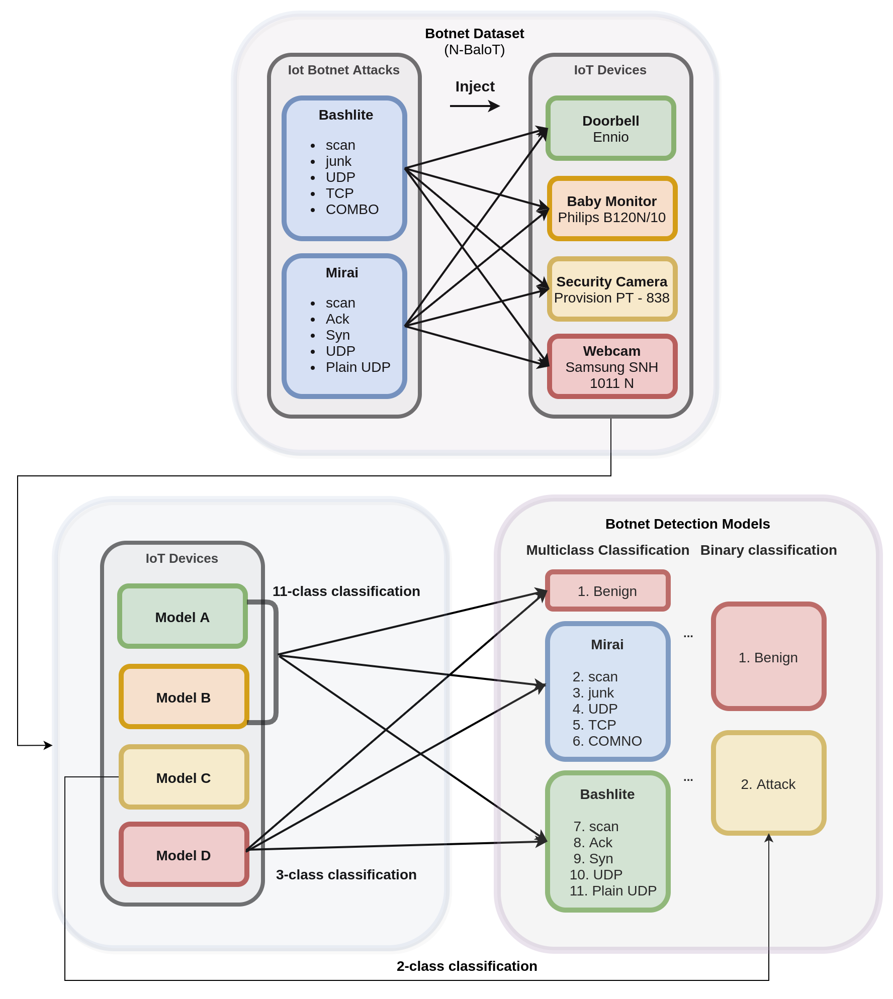
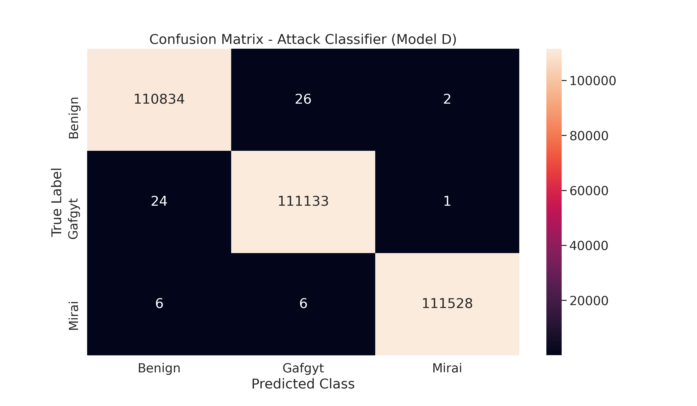

# The MiraiShield Project 
    


## Inspiration

There are billions of connected devices in 2021, and the applications with devices connected to the Internet are booming exponentially. This number is estimated to grow five fold in the next couple of years. If anything can stop IoT from taking over humanity, it is the security issues that arise with its public usage. Various malwares like the Mirai malware can take down a network and the current methods are not very effective against it. **We have shown how a Deep learning model can tackle these threats**.



## What is Mirai?

Mirai is a vicious malware that turns any IoT network into a network controlled by bots. This network of bots is called **Botnet** and this Botnet is used to disrupt the traffic of the network by overwhelming the network with a flood of requests. This is called **distributed denial-of-service (DDoS) attack**. If the default username and password is not changed, Mirai can log into the network and attack it.

## What is Bashlite?

Bashlite was used in large-scale **DDoS attacks** in 2014, but it has since crossed over to infecting IoT devices. In its previous iterations, Bashlite exploited **Shellshock** to gain a foothold into the vulnerable devices. An attacker can then remotely issue commands particularly, to launch DDoS attacks, and download other files to the compromised devices.

## Deep Learning

Deep learning is a subdomain of Machine Learning (ML) that uses Neural networks. If we analyse the network traffic, we'll be able to find which is Mirai attack and which is not. Lets say a network receives x requests per second normally. If it suddenly receives 2000x requests per second continuously, we can conclude its due to Mirai. So, if we're given the data about the network traffic, we can use that data to train a deep learning model to tell if it's infected by Mirai or not. 

In order to pre-train our model, we found an open-sourced dataset. [Link to the dataset](http://archive.ics.uci.edu/ml/datasets/detection_of_IoT_botnet_attacks_N_BaIoT). We used this dataset to pre-train our model. The **Keras-like code** has been demonstrated in this documentation, which can further be utilised.


---

## Training the Model

#### A Visual representation of the models


---

### Model A

We created a neural network with input layer of dimension **115** and then subsequent dense layers of dimensions **10, 40, 10, 1, 11** followed by a **Softmax activation** function. 

<div align = "center">
The accuracy of this model was 0.855.
</div>    
    
---

### Model B

This time we created a neural network with input layer of dimension **115** and then subsequent dense layers of dimensions **32, 72, 32, 1, 11** followed by a **Softmax activation** function. 

<div align = "center">
The accuracy of this model is 0.909.
   
    
</div>

&nbsp;

Models A and B are just an intelligent combination of multiple stages composed of **upsampling** and **downsampling** the feature space in order to simulate an **expand-reduce transformation**. This heuristic of designing our model does not perform as well as we require it to, as some information involving correlation between different features in the hidden dimensions is lost. Additionally, in the end, we apply a **Softmax layer** to obtain the probability distribution amongst all the 11 classes for easy classification into benign and the multiple sub-classes of malicious.


---

### Model C - Benign vs Malicious - Anomaly Detector

An **autoencoder** is a neural network trained to **reconstruct** its inputs after they have been compressed. It consists of an **encoder** and a **decoder** part, which each consists of Linear layers in our case. The compression ensures that the network learns meaningful concepts, mainly the relationships between its input features. If we train the autoencoder solely on benign instances, it will successfully reconstruct normal observations but fail to reconstruct abnormal observations. 

When a significant **reconstruction error** has been calculated, the given observations are classified as an anomaly. We optimize the parameters and hyperparameters of each trained model so that when applied to unseen traffic, the model maximizes the **true positive rate** and minimizes the **false positive rate** (wrongly marking benign data as malicious).

The Keras Deep Learning framework was used for modeling and evaluation in Python. This model is used to classify the collected data points into Benign or a Malicious Attack.

The **code**:

```python
# Initial Python package imports
import sys
import os
import pandas as pd
from glob import iglob
import numpy as np
from keras.models import load_model
import tensorflow as tf
from sklearn.preprocessing import StandardScaler

# Keras imports
from keras.models import Model, Sequential
from keras.layers import Input, Dense
from keras.callbacks import ModelCheckpoint, TensorBoard
from keras.optimizers import SGD

def train(top_n_features=10):

    scaler = StandardScaler()
    scaler.fit(x_train.append(x_opt))
    x_train = scaler.transform(x_train)
    x_opt = scaler.transform(x_opt)
    x_test = scaler.transform(x_test)

    model = autoenc_model(top_n_features)
    model.compile(loss="mean_squared_error",
                    optimizer="sgd")
    cp = ModelCheckpoint(filepath=f"models/model_{top_n_features}.h5",
                               save_best_only=True,
                               verbose=0)
    tb = TensorBoard(log_dir=f"./logs",
                histogram_freq=0,
                write_graph=True,
                write_images=True)

    # Train the model
    model.fit(x_train, x_train,
                    epochs=500,
                    batch_size=64,
                    validation_data=(x_opt, x_opt),
                    verbose=1,
                    callbacks=[cp, tb])

    x_opt_predictions = model.predict(x_opt)
    mse = np.mean(np.power(x_opt - x_opt_predictions, 2), axis=1)
    print("Mean is %.5f" % mse.mean())
    print("Min is %.5f" % mse.min())
    print("Max is %.5f" % mse.max())
    print("Std is %.5f" % mse.std())
    
    
    error_dev = mse.mean() + mse.std()

    with open(f'threshold_{top_n_features}', 'w') as t:
        t.write(str(error_dev))
    print(f"Threshold is {error_dev}")

    x_test_predictions = model.predict(x_test)
    print("MSE on the test set")
    mse_test = np.mean(np.power(x_test - x_test_predictions, 2), axis=1)
    over_ed = mse_test > error_dev
    false_positives = sum(over_ed)
    test_size = mse_test.shape[0]
    print(f"{false_positives} FP on the dataset without attacks - size {test_size}")
    

def autoenc_model(input_dim):
    autoencoder = Sequential()
    autoencoder.add(Dense(int(0.75 * input_dim), activation="tanh", input_shape=(input_dim,)))
    autoencoder.add(Dense(int(0.5 * input_dim), activation="tanh"))
    autoencoder.add(Dense(int(0.33 * input_dim), activation="tanh"))
    autoencoder.add(Dense(int(0.25 * input_dim), activation="tanh"))
    autoencoder.add(Dense(int(0.33 * input_dim), activation="tanh"))
    autoencoder.add(Dense(int(0.5 * input_dim), activation="tanh"))
    autoencoder.add(Dense(int(0.75 * input_dim), activation="tanh"))
    autoencoder.add(Dense(input_dim))
    return autoencoder

if __name__ == "__main__":
    train()
```

<div align = "center">
The accuracy of this model is 0.992.
</div>    


---

### Model D - Benign vs Mirai vs Bashlite - Attack Classifier

This model is used to classify the given attack into **Benign, Mirai or Gafgyt** (Bashlite).

The **code**:

```python
# Python Imports

import sys
import os
from glob import iglob
import pandas as pd
import numpy as np
import tensorflow as tf
import pickle

# Scikit-learn imports 
from sklearn.preprocessing import StandardScaler
from sklearn.metrics import confusion_matrix
from sklearn.model_selection import train_test_split

# Keras imports 
from keras.models import model_from_yaml
from keras.models import Model, Sequential
from keras.layers import Input, Dense, Activation
from keras.callbacks import ModelCheckpoint, TensorBoard
from keras.optimizers import Adam


def create_model(input_dim, add_hidden_layers, hidden_layer_size):
    model = Sequential()
    model.add(Dense(hidden_layer_size, activation="tanh", input_shape=(input_dim,)))
    for i in range(add_hidden_layers):
        model.add(Dense(hidden_layer_size, activation="tanh"))
    model.add(Dense(3))
    model.add(Activation('softmax'))
    return model

def train(top_n_features = None):
    df = load_data()
    train_with_data(top_n_features, df)

def train_with_data(top_n_features = None, df = None):
    X = df.drop(columns=['class'])
    if top_n_features is not None:
        fisher = pd.read_csv('/content/botnet-traffic-analysis/data/top_features_fisherscore.csv')
        features = fisher.iloc[0:int(top_n_features)]['Feature'].values
        X = X[list(features)]
    Y = pd.get_dummies(df['class'])
    print('Splitting data')
    x_train, x_test, y_train, y_test = train_test_split(X, Y, test_size=0.2, random_state=42)
    scaler = StandardScaler()
    print('Transforming data')
    scaler.fit(x_train)
    input_dim = X.shape[1]
    scalerfile = f'./models/scaler_{input_dim}.sav'
    pickle.dump(scaler, open(scalerfile, 'wb'))
    x_train = scaler.transform(x_train)
    x_test = scaler.transform(x_test)
    print('Creating a model')
    
    model = create_model(input_dim, 1, 128)
    model.compile(loss='categorical_crossentropy', optimizer='adam', metrics=['accuracy'])
    cp = ModelCheckpoint(filepath=f'./models/model_{input_dim}.h5',
                               save_best_only=True,
                               verbose=0)
    tb = TensorBoard(log_dir=f'./logs',
                histogram_freq=0,
                write_graph=True,
                write_images=True)
    epochs = 25
    model.fit(x_train, y_train,
                    epochs=epochs,
                    batch_size=256,
                    validation_data=(x_test, y_test),
                    verbose=1,
                    callbacks=[tb, cp])
                    
if __name__ == "__main__":
    train()           
```


<div align = "center">
The accuracy of this model is 0.998.
</div> 




---


The below diagrams represent the Hardware Flow and our Setup. We will be uploading the final video shortly. In the video below, you can observe the functioning of all 4 models. We have implemented **Model A and B** for exhaustive purposes of finding the subclass of BotNet attack, **Model C** for the detection of an anomaly, and **Model D** for the classification of an attack into its major classes of **Benign**, **Mirai** and **Bashlite**.


---

You can watch our **Video Demonstration** of the models we designed here! Just click on the video.




---

<div align = "center">
    
This is our Hardware setup for the experiment!

</div>


---


The Hardware **Code**:

```cpp
#include <ESP8266WiFi.h>
#include <ESPAsyncTCP.h>
#include <ESPAsyncWebServer.h>


const char* ssid = "REPLACE_WITH_YOUR_SSID";
const char* password = "REPLACE_WITH_YOUR_PASSWORD";

bool ledState = 0;
const int ledPin = 2;

AsyncWebServer server(80);
AsyncWebSocket ws("/ws");


time_t current_time;

const char* key = "vskvskbvskbvjskdbvk";
const AsyncWebSocketClient *script;

void notifyClients() {
  ws.textAll(String(ledState));
}

void handleWebSocketMessage(void *arg, uint8_t *data, size_t len,AsyncWebSocketClient *client) {
  AwsFrameInfo *info = (AwsFrameInfo*)arg;
  if (info->final && info->index == 0 && info->len == len && info->opcode == WS_TEXT) {
    data[len] = 0;
    if(strcmp(data,key)==0){
      script = client;
    }

    Serial.printf(data);
    

  }
}

void onEvent(AsyncWebSocket *server, AsyncWebSocketClient *client, AwsEventType type,
             void *arg, uint8_t *data, size_t len) {
    ws.text(script)(String(current_time,client));
    if(client == script){
      if(data){
        Serial.printf("Mirai Detected!");
        digitalWrite(ledPin, HIGH);        
      }
    }
    switch (type) {
      case WS_EVT_CONNECT:
        Serial.printf("WebSocket client #%u connected from %s\n", client->id(), client->remoteIP().toString().c_str());
        break;
      case WS_EVT_DISCONNECT:
        Serial.printf("WebSocket client #%u disconnected\n", client->id());
        break;
      case WS_EVT_DATA:
        handleWebSocketMessage(arg, data, len,client);
        break;
      case WS_EVT_PONG:
      case WS_EVT_ERROR:
        break;
  }
}

void initWebSocket() {
  ws.onEvent(onEvent);
  server.addHandler(&ws);
}


void setup(){
  Serial.begin(115200);
  current_time = time(NULL);

  pinMode(ledPin, OUTPUT);
  digitalWrite(ledPin, LOW);
  
  WiFi.begin(ssid, password);
  while (WiFi.status() != WL_CONNECTED) {
    delay(1000);
    Serial.println("Connecting to WiFi..");
  }


  Serial.println(WiFi.localIP());

  initWebSocket();

  server.on("/", HTTP_GET, [](AsyncWebServerRequest *request){
    request->send_P(200);
  });

  server.begin();
}

void loop() {
  ws.cleanupClients();
  digitalWrite(ledPin, ledState);
}


```


## Result 

The accuracies of our models are shown below:

    


---

We plot the **Training time, Inference time and Model Sizes** as shown below. We can observe that all 4 models we have designed can be implemented in real-time, since they have a low inference time and small size in the order of **KiloBytes**. Hence, the model can be deployed on the cloud, and even on edge devices using **Tensorflow Lite**.  
 

     


---

### References

```bibtex
@misc{Dua:2019 ,
author = "Dua, Dheeru and Graff, Casey",
year = "2017",
title = "{UCI} Machine Learning Repository",
url = "http://archive.ics.uci.edu/ml",
institution = "University of California, Irvine, School of Information and Computer Sciences" }
```


```bibtex
@ARTICLE{8490192,  
author={Meidan, Yair and Bohadana, Michael and Mathov, Yael and Mirsky, Yisroel and Shabtai, Asaf and Breitenbacher, Dominik and Elovici, Yuval},  
journal={IEEE Pervasive Computing},   
title={N-BaIoT—Network-Based Detection of IoT Botnet Attacks Using Deep Autoencoders},   
year={2018},  
volume={17},  
number={3},  
pages={12-22},  
doi={10.1109/MPRV.2018.03367731}}
```


